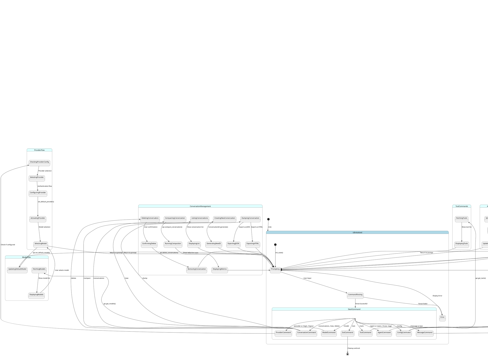

# Paws UI and Event Control Flow State Diagram

## PlantUML State Diagram



## ASCII Art State Diagram

```
┌─────────────────────────────────────────────────────────────────────────┐
│                           Paws UI & Event Flow                        │
└─────────────────────────────────────────────────────────────────────────┘

┌─────────────┐     ┌──────────────┐     ┌─────────────────┐
│   Startup   │────▶│   UI Init    │────▶│    Prompting    │
└─────────────┘     └──────────────┘     └────────┬────────┘
                                                   │
                                                   ▼
                                          ┌──────────────────┐
                                          │ Command Parsing │
                                          └───────┬────────┘
                                                  │
          ┌───────────────────────────────────────────┼─────────────────────────┐
          │                                   │                     │                 │
          ▼                                   ▼                     ▼                 ▼
    ┌──────────┐                      ┌────────────┐      ┌──────────┐    ┌──────────┐
    │ Message  │                      │   Agent    │      │ Provider │    │   Model  │
    └────┬─────┘                      └─────┬──────┘      └────┬─────┘    └────┬─────┘
         │                                   │                     │                 │
         ▼                                   ▼                     ▼                 ▼
    ┌──────────────┐                  ┌──────────┐         ┌──────────┐     ┌──────────┐
    │ Conversation  │                  │ Select   │         │ Configure │     │ Select   │
    │   Init       │                  │ Agent    │         │ Provider  │     │ Model    │
    └──────┬───────┘                  └────┬─────┘         └────┬─────┘     └────┬─────┘
           │                               │                     │                 │
           ▼                               ▼                     ▼                 ▼
    ┌──────────────┐                  ┌──────────────────────────────────────────────┐
    │  Create      │                  │              Update State              │
    │  ChatRequest  │                  │         (conversation_id, model, etc)     │
    └──────┬───────┘                  └────────────────────────┬─────────────────┘
           │                                            │
           ▼                                            ▼
    ┌──────────────┐                            ┌─────────────────┐
    │   Send to    │                            │  Return to     │
    │   API        │───────────────────────────────▶│   Prompting     │
    └──────┬───────┘                            └─────────────────┘
           │
           ▼
    ┌──────────────────────────────────────────────────────────────────────┐
    │                      PawsApp::chat()                          │
    └────────────────────────────┬─────────────────────────────────────┘
                             │
                             ▼
    ┌──────────────────────────────────────────────────────────────────────┐
    │                    Orchestrator::run()                         │
    │                                                              │
    │  ┌──────────────────────────────────────────────────────────┐   │
    │  │           Build Context                               │   │
    │  │  • SystemPrompt::new()                             │   │
    │  │  • UserPromptGenerator::new()                       │   │
    │  │  • ChangedFiles::new()                              │   │
    │  │  • ApplyTunableParameters::new()                     │   │
    │  └──────────────────────────┬───────────────────────────────┘   │
    │                         │                                      │
    │                         ▼                                      │
    │  ┌──────────────────────────────────────────────────────────┐   │
    │  │           Send to LLM                               │   │
    │  │  • execute_chat_turn()                             │   │
    │  └──────────────────────────┬───────────────────────────────┘   │
    │                         │                                      │
    │                         ▼                                      │
    │  ┌──────────────────────────────────────────────────────────┐   │
    │  │           Stream Responses                          │   │
    │  │  ┌────────────────────────────────────────────┐    │   │
    │  │  │ TaskReasoning    Display Reasoning      │    │   │
    │  │  │ TaskMessage      Display Content       │    │   │
    │  │  │ ToolCallStart   Execute Tool         │    │   │
    │  │  │ ToolCallEnd     Show Result          │    │   │
    │  │  │ RetryAttempt    Retry w/ Backoff     │    │   │
    │  │  │ Interrupt       Show Error          │    │   │
    │  │  └────────────────────────────────────────────┘    │   │
    │  └──────────────────────────┬───────────────────────────────┘   │
    │                         │                                      │
    │                         ▼                                      │
    │  ┌──────────────────────────────────────────────────────────┐   │
    │  │           Update Context                            │   │
    │  │  • context.append_message()                       │   │
    │  │  • Check compaction                              │   │
    │  │  • Check completion                              │   │
    │  └──────────────────────────┬───────────────────────────────┘   │
    │                         │                                      │
    │           ┌─────────────┴────────────┐                        │
    │           │                         │                        │
    │           ▼                         ▼                        │
    │    ┌─────────────┐         ┌─────────────┐                │
    │    │ Complete?   │         │ Continue?    │                │
    │    │   Yes       │         │   Yes        │                │
    │    └─────┬─────┘         └──────┬──────┘                │
    │          │                        │                         │
    │          ▼                        │                         │
    │    ┌─────────────┐             │                         │
    │    │ Save        │             │                         │
    │    │ Conversation │             │                         │
    │    └─────┬─────┘             │                         │
    │          │                    │                         │
    │          ▼                    │                         │
    │    ┌─────────────┐             │                         │
    │    │ Return to   │◀──────────┘                         │
    │    │  Prompting  │                                     │
    │    └─────────────┘                                     │
    │                                                         │
    └─────────────────────────────────────────────────────────────────┘
```

## Key Components and Their Roles

### UI Layer (`paws_main/src/ui.rs`)
- **UI**: Main orchestrator for user interface
- **UIState**: Maintains conversation_id and working directory
- **Console**: Handles user input via prompts
- **MarkdownWriter**: Renders markdown content to terminal

### Event Flow (`paws_domain/src/event.rs`)
- **Event**: Wraps user input (Text or Command)
- **EventValue**: Enum for Text(UserPrompt) or Command(UserCommand)
- **ChatRequest**: Contains Event + ConversationId

### Response Stream (`paws_domain/src/chat_response.rs`)
- **ChatResponse**: Streaming response enum
  - `TaskMessage`: Content (Title/PlainText/Markdown)
  - `TaskReasoning`: Agent reasoning output
  - `TaskComplete`: Turn completion signal
  - `ToolCallStart/End`: Tool execution notifications
  - `RetryAttempt`: Retry with backoff
  - `Interrupt`: Interruption (max requests/tool failures)

### Core Processing (`paws_app/src/app.rs`, `orch.rs`)
- **PawsApp**: Main application orchestrator
- **Orchestrator**: Manages agent execution loop
- **Context**: Conversation state with messages, tools, and configuration

### State Management
- **Conversation** (`paws_domain/src/conversation.rs`): Persistent conversation state
- **Context** (`paws_domain/src/context.rs`): Transient request/response state
- **ContextMessage**: Individual messages (Text, Tool, Image)

## Critical State Transitions

1. **User Input → Command Parsing**: Raw input parsed to `SlashCommand`
2. **Command → Event**: Commands converted to `Event` with conversation_id
3. **Event → API**: `ChatRequest` sent to `PawsApp::chat()`
4. **API → Orchestrator**: Stream spawned with `Orchestrator::run()`
5. **Orchestrator Loop**: Build context → Send to LLM → Process response → Repeat
6. **Response Stream**: Multiple `ChatResponse` events streamed back to UI
7. **State Persistence**: Conversation saved after each turn

## Error Handling States
- **RetryAttempt**: Automatic retry with exponential backoff
- **Interrupt**: Manual intervention required (max failures/requests)
- **ToolCallEnd**: Tool execution result (success or error)

## File References

- `crates/paws_main/src/ui.rs:89-102` - UI struct and initialization
- `crates/paws_main/src/ui.rs:292-404` - Main run loop and command handling
- `crates/paws_main/src/ui.rs:2327-2375` - Message handling and chat flow
- `crates/paws_main/src/ui.rs:2423-2501` - Chat response handling
- `crates/paws_main/src/state.rs:8-19` - UIState definition
- `crates/paws_domain/src/event.rs:44-61` - Event and EventValue types
- `crates/paws_domain/src/chat_request.rs:6-17` - ChatRequest structure
- `crates/paws_domain/src/chat_response.rs:47-56` - ChatResponse enum
- `crates/paws_app/src/app.rs:31-45` - PawsApp structure
- `crates/paws_app/src/app.rs:49-180` - Main chat orchestration
- `crates/paws_app/src/orch.rs:18-51` - Orchestrator structure
- `crates/paws_app/src/orch.rs:190-394` - Main execution loop
- `crates/paws_domain/src/conversation.rs:41-49` - Conversation structure
- `crates/paws_domain/src/context.rs:358-385` - Context structure
- `crates/paws_domain/src/context.rs:28-34` - ContextMessage enum

## State Data Structures

### UIState
```
- cwd: PathBuf
- conversation_id: Option<ConversationId>
```

### Conversation
```
- id: ConversationId
- title: Option<String>
- context: Option<Context>
- metrics: Metrics
- metadata: MetaData
```

### Context
```
- conversation_id: Option<ConversationId>
- messages: Vec<MessageEntry>
- tools: Vec<ToolDefinition>
- tool_choice: Option<ToolChoice>
- max_tokens: Option<usize>
- temperature: Option<Temperature>
- stream: Option<bool>
```

### Event Types
```
- EventValue::Text(UserPrompt)
- EventValue::Command(UserCommand)
```

### ChatResponse Types
```
- TaskMessage { content }
- TaskReasoning { content }
- TaskComplete
- ToolCallStart(ToolCallFull)
- ToolCallEnd(ToolResult)
- RetryAttempt { cause, duration }
- Interrupt { reason }
```
